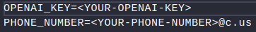

# Whatsapp-bot-with-openIA

This is my new project, using the openIA with the venom-bot API.

To run this project in your local machine, you need to make a very simple steps.

First, you need to register in the Official Site of OpenIA 
https://openai.com/
<br>
To use this API you need to generate a key in the Documentation.
https://platform.openai.com/docs/quickstart/build-your-application 
<br>
Click in 'Create new secret key' and copy the key. <br>

<br>
# .env
Go to the file <i>.env.examples.</i> and replace the value OPENIA_KEY for your key.
<br>
Now, change the name of the file <i>.env.examples.</i> for just .env
<br>
In the variable PHONE_NUMBER replace for your number.<br>
Following this example: PHONE_NUMBER=5511954545454@c.us<br>

<br>
<br>
# Installing all dependencies
Now you are ready to install the dependencies of project.

```bash
npm install
```

Run the application
```bash
npm start
```
<br>
<br>

Now, you need to a number for Teteu bot.  
**Remember** don't use your own number.    
Scan de QRCode with the option *Connected Devices*